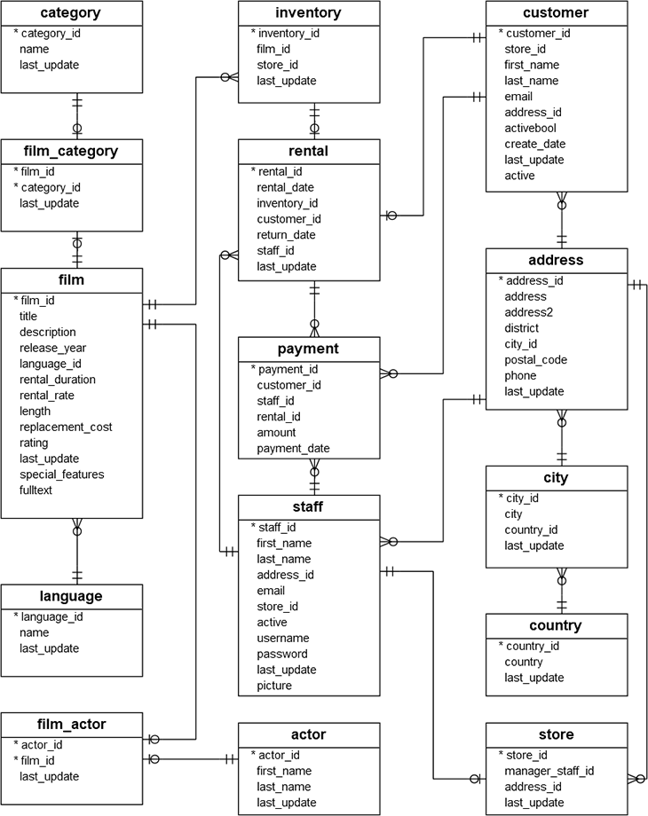

# Welcome to the DVD rental dbt project!

Here is the database schema that we will work with:



## Getting started

- Create a Google Cloud project and enable billing
- Create a service account and grant that acccount the `roles/bigquery.admin`
- Go to [getdbt.com](https://getdbt.com) and create a new account.
- Login to dbt Cloud and configure a project

## Using the starter project

Try running the following commands:
```
dbt deps # Install dependencies
dbt seed # Load data into the datawarehouse
dbt run # Run all models
dbt test # Test all models
```

### Resources:
- Learn more about dbt [in the docs](https://docs.getdbt.com/docs/introduction)
- Check out [Discourse](https://discourse.getdbt.com/) for commonly asked questions and answers
- Join the [chat](http://slack.getdbt.com/) on Slack for live discussions and support
- Find [dbt events](https://events.getdbt.com) near you
- Check out [the blog](https://blog.getdbt.com/) for the latest news on dbt's development and best practices
